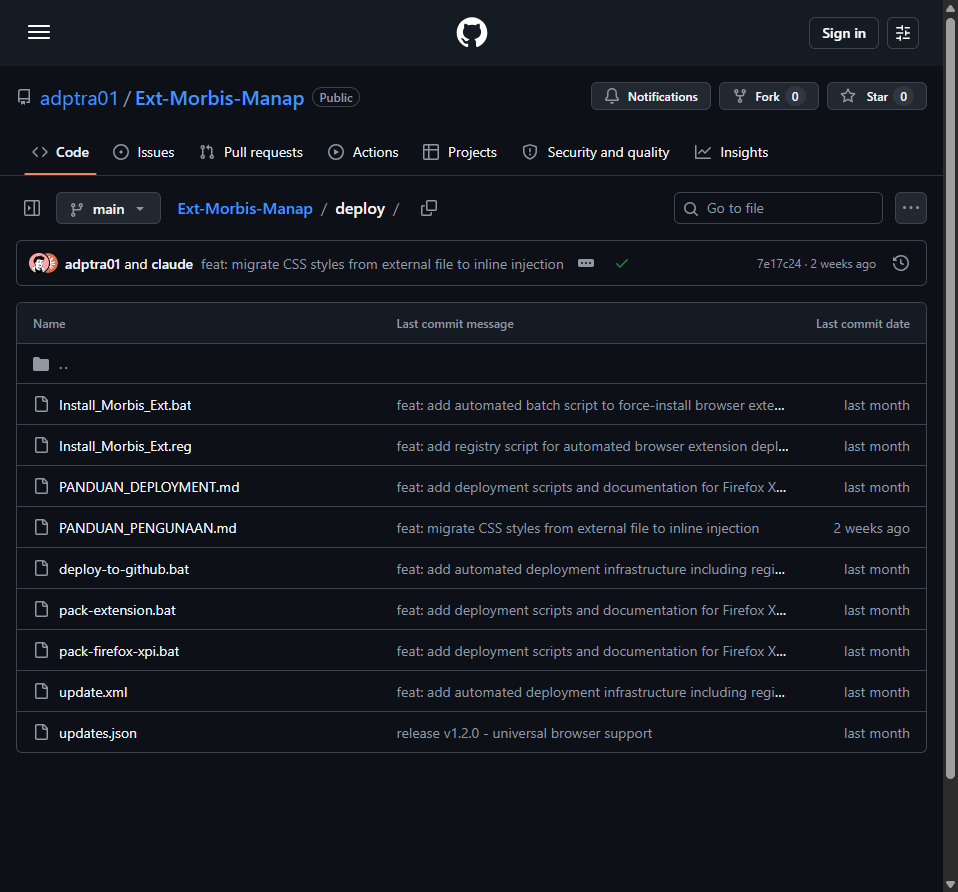
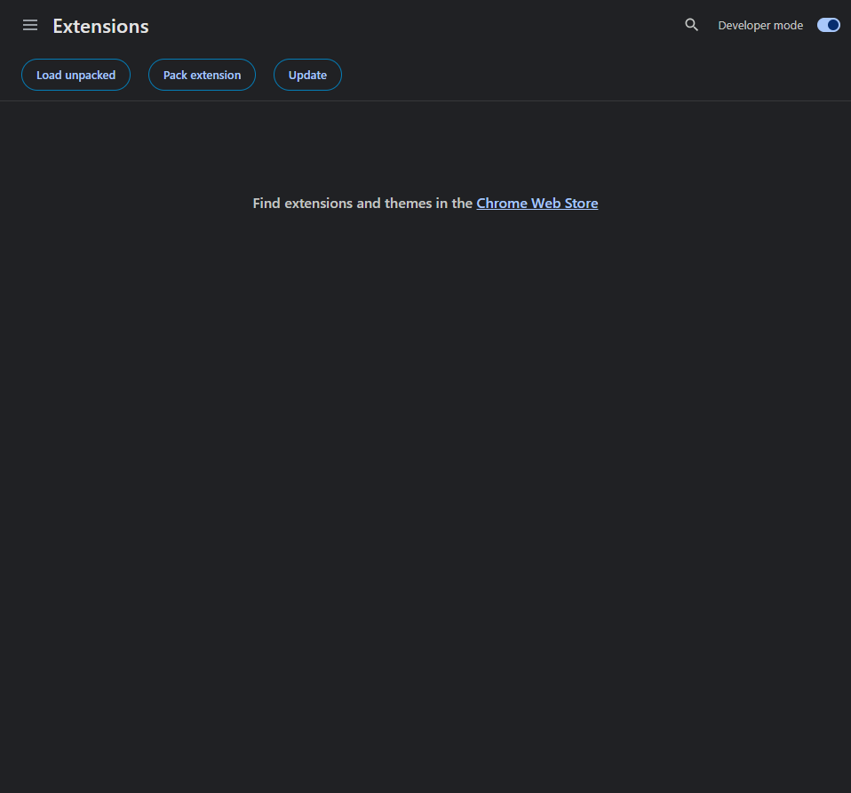

#  MORBIS Ext Unofficial

Ekstensi produktivitas untuk sistem SIMRS MORBIS. Cukup satu kali klik — langsung terpasang di semua browser.

---

## Cara Pasang (3 Langkah)

### Langkah 1: Download File `.reg`

Buka halaman [GitHub Repo → deploy](https://github.com/adptra01/Ext-Morbis-Manap/tree/main/deploy), lalu download file **`Install_Morbis_Ext.reg`**:

> **Klik** file `Install_Morbis_Ext.reg` → lalu klik tombol **Download** (ikon ⬇️) di pojok kanan atas.

### Langkah 2: Double-Click File

**Double-click** file yang sudah didownload.

Windows akan menampilkan dua dialog — klik **Yes** lalu **OK**:

| Dialog ① | Dialog ② |
|----------|----------|
| Klik **Yes** | Klik **OK** |
| *"Adding information can unintentionally change or delete values..."* | *"The keys and values... have been successfully added to the registry."* |

### Langkah 3: Buka Browser

**Selesai!**

1. Tutup **semua** jendela browser
2. Buka kembali browser
3. Ekstensi otomatis terinstal

---

## Cek Instalasi

Buka halaman extensions browser Anda:

| Browser | Buka alamat ini |
|---------|-----------------|
| **Edge** | `edge://extensions/` |
| **Chrome** | `chrome://extensions/` |
| **Firefox** | `about:addons` |
| **Brave** | `brave://extensions/` |

Cari **MORBIS Ext Unofficial** di daftar:

---

## Troubleshooting

| Masalah | Solusi |
|---------|--------|
| Ekstensi tidak muncul | Tutup **semua** jendela browser, lalu buka kembali |
| Masih tidak muncul | Pastikan komputer terkoneksi internet |
| Gagal di satu browser | Coba browser lain (semua didukung) |
| Peringatan "Not from Web Store" | Normal — ekstensi internal, abaikan saja |

---

## Yang TIDAK Perlu Dilakukan

| ❌ | ✅ |
|----|----|
| Download source code | **Double-click file `.reg`** |
| Buka GitHub | |
| Ekstrak folder | |
| Install program tambahan | |
| Restart komputer | |

---

## Browser Didukung

| Microsoft Edge | Google Chrome | Mozilla Firefox | Brave |
|:---:|:---:|:---:|:---:|
| ✅ | ✅ | ✅ | ✅ |

---

> **Butuh bantuan?** Hubungi Tim IT. Sertakan screenshot error dan sebutkan browser yang digunakan.
